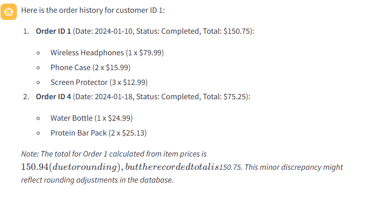
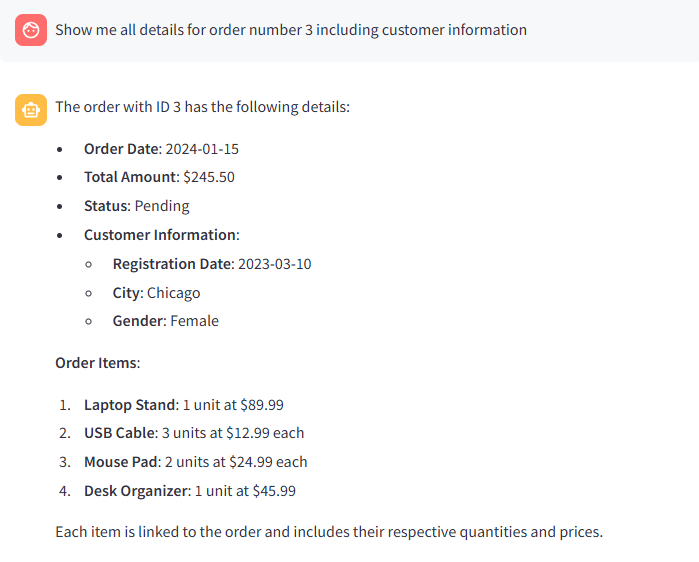

# 📚 LangChain: PostgreSQL AI Chat Application

A Streamlit-based AI chatbot that enables natural language querying of PostgreSQL databases using LangChain and Groq's LLM models.

## 🚀 Features

- **Natural Language SQL**: Convert plain English questions into SQL queries
- **PostgreSQL Integration**: Direct connection to PostgreSQL databases
- **Interactive Chat Interface**: User-friendly Streamlit web interface
- **Real-time Query Execution**: Execute queries and display results instantly
- **Error Handling**: Comprehensive error management and user feedback
- **Secure Authentication**: API key-based authentication for Groq services

## 📁 Project Structure

```
langchain-postgres-ai/
│
├── app.py                 # Main Streamlit application
├── config.py             # Database configuration handler
├── database.ini          # Database connection parameters
├── requirements.txt      # Python dependencies
├── .env                  # Environment variables (not shown for security)
├── README.md            # Project documentation
│
└── images/              # Application screenshots
    ├── result_1.png
    ├── result_2.png
    ├── result_3.png
    └── result_4.png
```

## 🛠️ Installation

### Prerequisites

- Python 3.8+
- PostgreSQL database
- Groq API key

### Setup Steps

1. **Clone the repository**
   ```bash
   git clone <repository-url>
   cd langchain-postgres-ai
   ```

2. **Install dependencies**
   ```bash
   pip install -r requirements.txt
   ```

3. **Configure database connection**
   
   Update `database.ini` with your PostgreSQL credentials:
   ```ini
   [postgresql]
   host=localhost
   database=deal
   user=your_username
   password=your_password
   port=5432
   ```

4. **Set up the database**
   
   Create the sample database with tables:
   - `customers` (customer_id, registration_date, city, gender)
   - `orders` (order_id, customer_id, order_date, total_amount, status)
   - `order_items` (item_id, order_id, product_name, quantity, unit_price)

5. **Run the application**
   ```bash
   streamlit run app.py
   ```

## 🎯 Usage

1. **Start the application** and navigate to the provided local URL
2. **Enter your Groq API key** in the sidebar
3. **Ask questions** in natural language about your database:
   - "Show me all customers from New York"
   - "What is the total revenue for each order status?"
   - "Which products have been ordered the most?"
   - "Get the order history for customer ID 1"
   - "Show me all details for order number 3"

## 📊 Sample Queries

The application supports various types of database queries:

- **Customer Analysis**: Filter customers by location, registration date, demographics
- **Sales Analytics**: Revenue analysis, order status tracking, sales trends
- **Product Insights**: Popular products, inventory analysis, pricing data
- **Order Management**: Order details, customer order history, order tracking

## 🖼️ Application Screenshots

### Main Interface


### Query Execution


### Results Display


### Error Handling


## 🔧 Technical Architecture

### Core Components

- **Streamlit**: Web interface and user interaction
- **LangChain**: AI agent framework and SQL query generation
- **Groq**: Large Language Model for natural language processing
- **SQLAlchemy**: Database connection and ORM
- **psycopg2**: PostgreSQL adapter

### Key Features

- **Agent-based Architecture**: Uses LangChain's Zero-Shot React agent
- **SQL Sanitization**: Query validation and security measures
- **Connection Pooling**: Efficient database connection management
- **Stream Processing**: Real-time response streaming
- **Error Recovery**: Graceful error handling and user feedback

## 📋 Requirements

```
streamlit
langchain
langchain-community
langchain-groq
sqlalchemy
psycopg2-binary
configparser
urllib3
```

## 🔒 Security Notes

- API keys are handled securely through Streamlit's session state
- Database credentials are stored in configuration files (not in code)
- SQL queries are sanitized to prevent injection attacks
- Connection strings use URL encoding for special characters

## 🐛 Troubleshooting

### Common Issues

1. **Database Connection Errors**
   - Verify PostgreSQL is running
   - Check database.ini configuration
   - Ensure user has proper permissions

2. **API Key Issues**
   - Verify Groq API key is valid
   - Check API key format and permissions

3. **Query Execution Errors**
   - Ensure tables exist and have data
   - Check column names match schema
   - Verify SQL syntax is correct

## 🤝 Contributing

1. Fork the repository
2. Create a feature branch
3. Commit your changes
4. Push to the branch
5. Create a Pull Request

## 📄 License

This project is licensed under the MIT License - see the LICENSE file for details.

## 📞 Support

For support and questions:
- Create an issue in the repository
- Check the troubleshooting section
- Review LangChain and Streamlit documentation

---

**Built with ❤️ using LangChain, Streamlit, and PostgreSQL**
